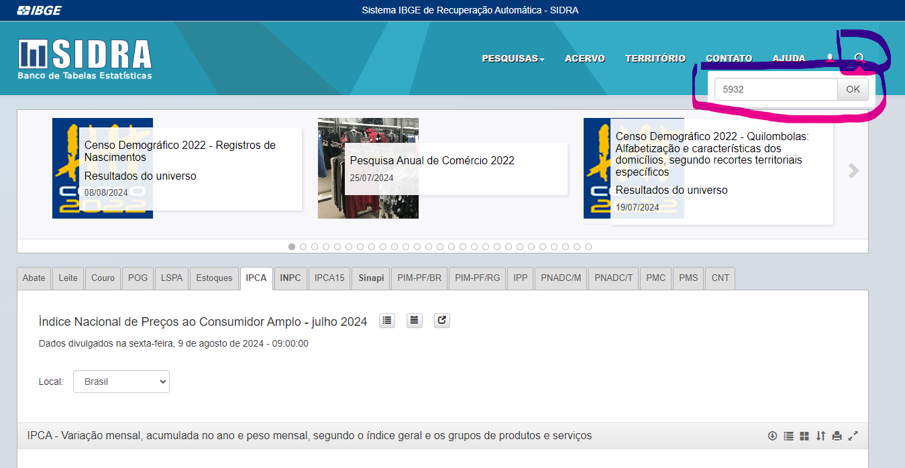
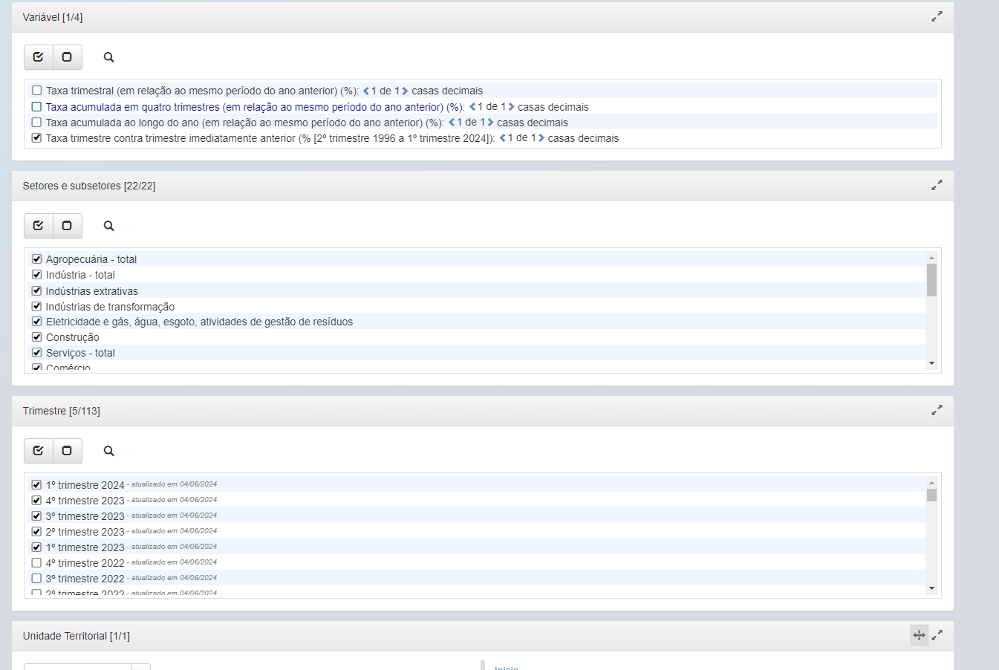
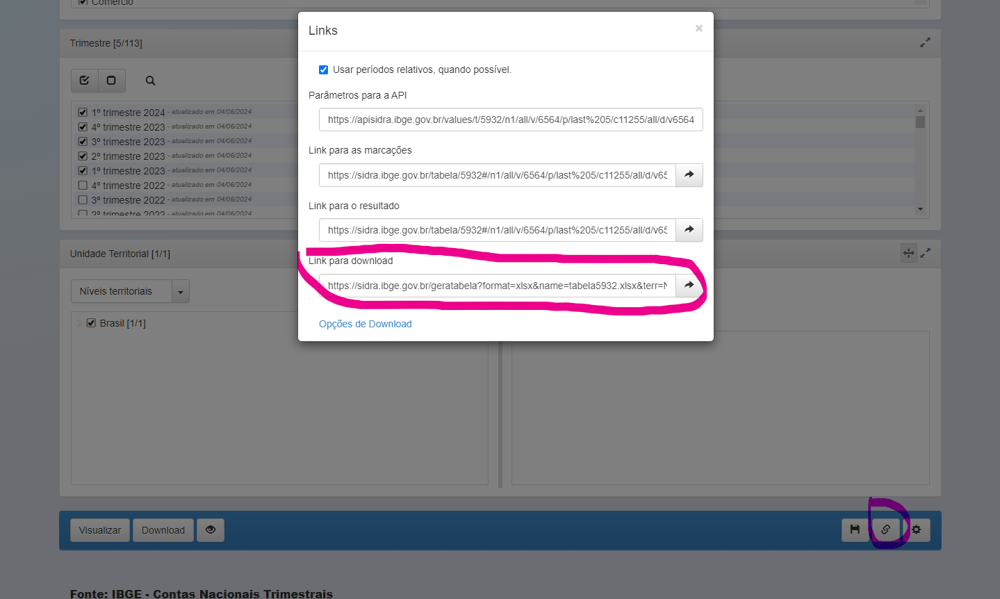

# How you can generate a link for codes_ibge_link

Access the [IBGE SIDRA](https://sidra.ibge.gov.br/) Website:

Search for the series you want by using the search bar in the top right corner.

In the next step, you will select the characteristics you want for the series.

Finally, click on the share link in the lower right corner, and a tab will open to copy the link.

